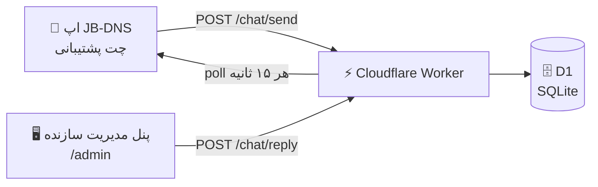
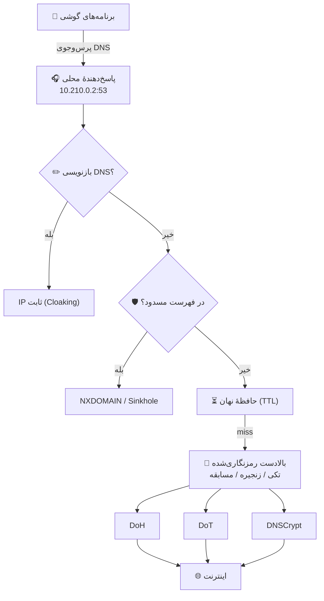

<p align="center">
  
</p>

<h1 align="center">JB-DNS</h1>

<p align="center">
  <strong>تونل DNS رمزنگاری‌شدهٔ اندروید — بدون کند شدن اینترنت شما.</strong><br>
  ساخته‌شده برای ایران 🇮🇷 · مفید برای همه‌جا
</p>

<p align="center">
  <a href="https://github.com/EmamShahrooz-JB/JB-DNS/releases/latest"></a>
  <a href="LICENSE"></a>
  <a href="https://github.com/EmamShahrooz-JB/JB-DNS/releases/latest"></a>
  
</p>

<p align="center">
  
  
  
  
  
</p>

<details>
<summary><b>English — What is JB-DNS?</b> 🌍</summary>

A fast, secure DNS client for Android: DoH · DoT · DNSCrypt v2 with built-in
ad/tracker/malware blocking (~7,000 bundled domains), server chains with automatic
failover, race mode, DNS rewrite (cloaking), DNS leak prevention, battery wizard,
backup/restore, a home-screen widget — and a **built-in two-way support chat**
(Telegram-style) backed by a Cloudflare Worker + D1 database.

The tunnel is **DNS-only**: it never routes the rest of your traffic, so your
internet speed stays untouched. Built for Iran 🇮🇷 (20+ Iranian resolvers:
Shecan, 403, Radar Game, Electro, Begzar…), useful everywhere.

</details>

---

## 📑 فهرست

**[در یک نگاه](#-در-یک-نگاه)** · **قابلیت‌ها** · **[نصب](#-نصب)** · **گفتگوی پشتیبانی** ·
**معماری** · **ساخت از سورس** · **تست‌ها** · **مقایسه** · **نقشه راه** ·
**محدودیت‌ها** · **لایسنس و اعتبارها** · **تاریخچه**

---

## 🚀 در یک نگاه

- **🔒 سه پروتکل رمزنگاری‌شده** در یک اپ: DoH · DoT · DNSCrypt v2 (+ DNS کلاسیک)
- **🛡 مسدودسازی آمادهٔ تبلیغ/ردیاب/بدافزار** — ۴ فهرست، ~۷٬۰۰۰ دامنه، داخل خود APK (بدون نیاز به دانلود)
- **⚡ فقط DNS تونل می‌شود** — بقیهٔ ترافیک گوشی دست‌نخورده می‌ماند؛ سرعت اینترنت شما تغییر نمی‌کند
- **🔁 هرگز بدون سرور نمی‌مانید** — زنجیرهٔ پشتیبان خودکار + حالت مسابقه (سریع‌ترین پاسخ برنده)
- **💬 پشتیبانی دوطرفه در خود اپ** — چت تلگرام‌مانند با سازنده، روی Cloudflare Worker + D1
- **🇮🇷 ۲۰+ سرور ایرانی آماده** — شکن، ۴۰۳، رادار گیم، الکترو، بگذر و… + سرورهای جهانی + سفارشی

---

## ✨ قابلیت‌ها

| قابلیت | توضیح |
|---|---|
| 🔐 DNS رمزنگاری‌شده | **DoH** (RFC 8484)، **DoT** (پورت ۸۵۳)، **DNSCrypt v2** و DNS کلاسیک |
| 🌍 سرورهای آماده | ۲۰+ سرور ایرانی و جهانی (Cloudflare، Google، Quad9، AdGuard، Mullvad، Control D…) + سرور سفارشی |
| 🔗 زنجیرهٔ سرور پشتیبان | قطعی سرور فعال؟ پرس‌وجوی بعدی خودکار از پشتیبان پاسخ می‌گیرد + کاوش بازیابی هر ۳۰ ثانیه |
| ⚡ حالت مسابقه (Race) | پرس‌وجوی هم‌زمان از کل زنجیره — سریع‌ترین پاسخ برنده (الگوی `lb_strategy` در dnscrypt-proxy) |
| 🗂 فهرست‌های مسدودسازی آماده | تبلیغات · ردیاب · بدافزار · خانواده (داخل APK) + فهرست hosts راه دور دلخواه (Pi-hole شخصی) |
| ✏️ بازنویسی DNS | قواعد «دامنه → IP ثابت» با پاسخ فوری آفلاین (Cloaking) + بلاک وایلدکارد زیردامنه‌ها |
| 🛡 ضد-نشت DNS | رهگیری DNSهای هاردکدشدهٔ برنامه‌ها و DNSهای عمومی + هشدار حالت Strict اندروید |
| 🧪 تست سلامت داخلی | ۶ بررسی واقعی: رمزنگاری، پاسخ‌گویی، تشخیص IP فیلترینگ، مسدودسازی و… |
| 📊 آمار و نمودار | نمودار ۲۴ ساعتهٔ پرس‌وجو/مسدودشده + پربارش‌ترین دامنه‌ها + لاگ زنده |
| 🚫 مسدودسازی از لاگ | مسدود/استثنا کردن هر دامنه با یک ضربه از روی لاگ زنده |
| 🔀 تونل افتراقی | عبور DNS فقط از برنامه‌های انتخابی (Split Tunneling) با آیکون واقعی اپ‌ها |
| 🔋 ویزارد باتری | گام‌به‌گام برای شیائومی/هواوی/OPPO/vivo تا سرویس بسته نشود + میان‌بر تنظیمات |
| 💾 پشتیبان‌گیری تنظیمات | خروجی/ورودی JSON همهٔ تنظیمات — انتقال به گوشی جدید |
| 💬 گفتگوی پشتیبانی | چت تلگرام‌مانند دوطرفه با تیک ارسال/خوانده‌شدن + پیام خودکار ربات + پیوست اختیاری اطلاعات فنی/لاگ |
| 📲 کاشو و ویجت | کاشوی Quick Settings (وصل بدون باز کردن برنامه) + ویجت صفحهٔ اصلی |
| 🔊 اعلان صوتی | ویس «DNS Online / DNS Offline» (قابل خاموش‌کردن) |
| 🎨 پوستهٔ تیره/روشن | رابط فارسی RTL، فونت وزیرمتن، پالت Ocean Blue Serenity |

---

## 📥 نصب

<p align="center">
  <a href="https://github.com/EmamShahrooz-JB/JB-DNS/releases/latest">
    <br>
    <b>دوربین گوشی را روی QR بگیرید</b>
  </a>
</p>

1. آخرین APK امضاشده را از **[Releases](../../releases)** بگیرید (حداقل اندروید **۷٫۰ / API 24**)
2. فایل را نصب کنید (اجازهٔ «نصب از منابع ناشناس» لازم است)
3. دکمهٔ ⏻ را بزنید — اندروید پنجرهٔ تأیید VPN را نشان می‌دهد؛ این الزام سیستم‌عامل است
   و فقط برای ساخت تونل محلی DNS است

---

## 💬 گفتگوی پشتیبانی دوطرفه

از نسخهٔ ۴٫۲، کاربر لازم نیست منتظر «نسخهٔ بعدی» بماند — **مستقیم با سازنده چت می‌کند**:

<p align="center">
  
</p>

- تیک‌های تلگرامی: ⏱ در حال ارسال → ✓ رسید → **✓✓ خوانده‌شدن توسط سازنده**
- پیام خودکار ربات در شروع گفتگو + پیوست اختیاری «اطلاعات فنی» و «۲۰ لاگ اخیر» (پیش‌فرض خاموش)
- شناسهٔ گفتگو در دستگاه می‌ماند — گفتگو همیشه ادامه دارد و همان «کد پیگیری» است
- حریم خصوصی: IP هرگز خام ذخیره نمی‌شود (فقط هش)؛ حذف خودکار پس از ۹۰ روز



کد کامل سرور (Worker + D1 + پنل مدیریت فارسی با ۵ تم رنگی) در
**[cloudflare-worker/](cloudflare-worker/)** — قابل دیپلوی روی حساب Cloudflare خودتان.

---

## 🏗 معماری



**نکتهٔ طراحی مهم:** تونل *هیچ* مسیر catch-all (`0.0.0.0/0`) اضافه نمی‌کند.
فقط آدرس پاسخ‌دهندهٔ محلی در تونل مسیر دارد، پس تنها بسته‌های DNS وارد تونل می‌شوند
و بقیهٔ ترافیک گوشی از شبکهٔ اصلی می‌رود. خودِ برنامه هم با
`addDisallowedApplication` از تونل مستثناست تا درخواست‌های بالادست حلقه نزنند.
مسیرهای ضد-نشت (الگوی NetGuard) پرس‌وجوهای مستقیم به DNSهای عمومی را هم به تونل
برمی‌گردانند.

<details>
<summary><b>📁 ساختار کد</b></summary>

```
app/src/main/java/ir/jbdns/
├── core/
│   ├── Dns.kt               کدک خام DNS (RFC 1035) — خالص و قابل تست روی JVM
│   ├── IpUdp.kt             لایهٔ IPv4/UDP تونل + checksum RFC 1071
│   ├── DnsStub.kt           پاسخ‌دهندهٔ محلی: بازنویسی + مسدودسازی + کش + آمار
│   ├── BlockList.kt         تطبیق دامنه/زیردامنه/وایلدکارد
│   ├── BlocklistCatalog.kt  فهرست‌های آمادهٔ داخل APK (کش درون‌فرایندی)
│   ├── Benchmark.kt         سرعت‌سنجی واقعی سرورها
│   ├── HealthCheck.kt       تست سلامت داخلی (۶ بررسی)
│   ├── BatteryWizard.kt     ویزارد باتری/اجرای خودکار سازندگان
│   ├── SettingsBackup.kt    مدل پشتیبان JSON — خالص و تست‌پذیر
│   ├── RemoteBlocklist.kt   فهرست hosts راه دور
│   ├── Feedback.kt          payload چت پشتیبانی — خالص و تست‌پذیر
│   └── VpnStats.kt          وضعیت، لاگ زنده و آمار ۲۴ ساعته
├── net/
│   ├── UpstreamResolvers.kt DoH • DoT • DNSCrypt • زنجیره (Chain) • مسابقه (Race) • Fallback با کلید قطع‌کن
│   ├── UpstreamFactory.kt   ساخت ریزالور از تنظیمات
│   └── DnsVpnService.kt     سرویس VPN، ضد-نشت، watchdog، اعلان پایدار
├── data/                    Server، سرورهای آماده، Prefs
└── ui/                      TunnelWidget (ویجت) — رابط کاربری: WebView + پل JS
```

رابط کاربری کامل (فارسی/RTL) یک فایل خودکفاست: `app/src/main/assets/index.html` —
بدون وابستگی خارجی (فونت و آیکون درون‌سازی‌شده) و با پل `Android.*` به کاتلین.

</details>

---

## 🔨 ساخت از سورس

### با Android Studio
پروژه را باز کنید و `Build > Build APK(s)` را بزنید.

### با خط فرمان
```bash
./setup-tools.sh                      # نصب خودکار JDK 17 + Android SDK 34 + Gradle 8.7 (یک‌بار)
./build.sh :app:testReleaseUnitTest   # اجرای تست‌ها (۸۴ تست)
./build.sh :app:assembleRelease       # ساخت APK
```

### امضای release
فایل‌های `jbdns.keystore` و `keystore.properties` **عمداً در مخزن نیستند** (کلید امضا
هرگز عمومی نمی‌شود). برای ساخت release امضاشده:

```bash
keytool -genkeypair -keystore jbdns.keystore -alias jbdns -keyalg RSA -keysize 2048 -validity 12000
```

و فایل `keystore.properties` کنار `build.gradle.kts`:

```properties
storeFile=jbdns.keystore
storePassword=رمز-شما
keyAlias=jbdns
keyPassword=رمز-شما
```

بدون این فایل‌ها، بیلد release **بدون امضا** تولید می‌شود و بیلد debug همیشه کار می‌کند.

---

## ✅ تست‌ها

**۸۴ تست خودکار**، شامل تست روی **شبکهٔ واقعی**:

| مجموعه | تعداد | چه چیزی را می‌سنجد |
|---|---|---|
| `DnsCodecTest` | ۱۱ | ساخت/تجزیهٔ بستهٔ DNS، فشرده‌سازی اشاره‌گر، بستهٔ ناقص |
| `DnsStubTest` | ۸ | مسدودسازی، Sinkhole، کش، SERVFAIL، مسدودسازی IPv6 |
| `IpUdpTest` | ۶ | بستهٔ خام تونل، checksum، جابه‌جایی آدرس/پورت |
| `BlockListTest` | ۷ | تطبیق زیردامنه، قواعد دقیق، دامنه‌های شبیه |
| `DnscryptTest` | ۱۳ | رمزنگاری DNSCrypt v2 (X25519، XSalsa20-Poly1305) با برداشت مرجع dnscrypt-proxy |
| `LiveResolverTest` | ۶ | **DoH واقعی به Google/Quad9، DoT واقعی پورت ۸۵۳، DNS ساده، NXDOMAIN** |
| `CircuitBreakerTest` | ۳ | کلید قطع‌کن پس از شکست‌های پیاپی |
| `FailoverAndAllowTest` | ۴ | زنجیرهٔ پشتیبان + بازیابی + دامنه‌های استثنا |
| `RaceResolverTest` | ۴ | حالت مسابقه: سریع‌ترین برنده، شکست اعضا، خطای کل |
| `HealthCheckTest` | ۴ | تست سلامت: تشخیص IP فیلترینگ، رمزنگاری، خطاها |
| `SettingsBackupTest` | ۴ | رفت‌وبرگشت پشتیبان، رد فایل خراب/غیره |
| `RewriteAndWildcardTest` | ۵ | بازنویسی DNS، اولویت بر مسدودسازی، وایلدکارد |
| `FeedbackTest` | ۹ | payload چت پشتیبانی + اعتبارسنجی دوطرفه (یکسان با سرور) |

علاوه بر آن، UI چت و پنل مدیریت با **تست DOM** (jsdom) پوشش داده شده‌اند —
از جمله در شبیه‌سازی iframe امن.

```bash
./build.sh :app:testReleaseUnitTest
```

---

## 🆚 مقایسه

بر اساس مستندات عمومی پروژه‌ها — ممکن است با نسخه‌های جدیدتر متفاوت باشد:

| | JB-DNS | Intra | RethinkDNS | DNS66 |
|---|---|---|---|---|
| DoH / DoT / DNSCrypt | ✅ هر سه | DoH | DoH/DoT | — |
| فهرست مسدودسازی داخل اپ | ✅ ۴ فهرست | — | راه دور | hosts |
| تونل فقط-DNS (سرعت بقیهٔ ترافیک دست‌نخورده) | ✅ | ✅ | ✳ تونل کامل | ✅ |
| زنجیرهٔ پشتیبان + حالت مسابقه | ✅ | — | — | — |
| بازنویسی DNS (Cloaking) | ✅ | — | — | — |
| چت پشتیبانی دوطرفه درون‌برنامه | ✅ | — | — | — |
| رابط فارسی RTL | ✅ | — | — | — |

---

## 🗺 نقشه راه

- [ ] رابط انگلیسی (دوزبانه شدن اپ)
- [ ] سرعت‌سنجی مقایسه‌ای همهٔ سرورها با هم
- [ ] فهرست‌های مسدودسازی شخصی (ویرایش در اپ)
- [ ] مشارکت شما؟ Pull Request ها خوش‌آمدند! 🙌

---

## ⚠️ نکته‌ها و محدودیت‌ها

- **DoQ (DNS-over-QUIC) پیاده‌سازی نشده** — به پشتهٔ QUIC کامل نیاز دارد؛ DoH و DoT
  هر دو رمزنگاری‌شده‌اند.
- روی بعضی شبکه‌های محدودکننده، پورت ۸۵۳ (DoT) بسته است؛ در این حالت DoH کارگشاست.
- این برنامه **پروکسی/فیلترشکن نیست**؛ فقط مسیر DNS را امن می‌کند. سرورهای ایرانی
  (شکن، ۴۰۳، …) خودشان برای رفع تحریم طراحی شده‌اند.
- سرورهای ایرانی فقط از داخل شبکهٔ ایران پاسخ می‌دهند (در فهرست برچسب خورده‌اند).

---

## ⚖️ لایسنس و اعتبارها

- کد پروژه تحت **GPL-3.0** منتشر می‌شود — فایل [LICENSE](LICENSE).
- **چرا GPL؟** فهرست‌های مسدودسازی [Disconnect](https://disconnect.me) که در
  `assets/blocklists/` بسته‌بندی شده‌اند زیر مجوز GPLv3 هستند؛ برای توزیع سازگار،
  کل پروژه هم‌مجوز آن‌ها شد (همان مسیری که NetGuard رفته است).
- منابع فهرست‌های مسدودسازی: **Disconnect** (simple_ad / simple_tracking — GPLv3) ·
  **[URLhaus](https://urlhaus.abuse.ch) by abuse.ch** (CC0) · فهرست «خانواده» دست‌گردآوری خودمان.
- آیکون‌ها: [Material Icons](https://github.com/google/material-design-icons)
  (Apache 2.0) — جزئیات کامل در **[ICONS.md](ICONS.md)**.
- انیمیشن پنل مدیریت: [Anime.js](https://animejs.com) v3.2.2 (MIT) · فونت پنل:
  [Vazirmatn](https://github.com/rastikerdar/vazirmatn) (OFL).
- الگوهای معماری با ذکر منبع در کد، از پروژه‌های
  **[Intra](https://github.com/Jigsaw-Code/intra)** (Apache 2.0) ·
  **[NetGuard](https://github.com/M66B/NetGuard)** (GPL-3.0) ·
  **[dnscrypt-proxy](https://github.com/DNSCrypt/dnscrypt-proxy)** (ISC) ·
  **[RethinkDNS](https://github.com/celzero/rethink-app)** (MPL-2.0) ·
  **[DNS66](https://github.com/julian-klode/dns66)** (GPL-3.0) الهام گرفته‌اند.

---

## 🎨 پالت رنگ — Ocean Blue Serenity

`#03045E` · `#023E8A` · `#0077B6` · `#0096C7` · `#00B4D8` · `#48CAE4` · `#90E0EF` · `#ADE8F4` · `#CAF0F8`

---

## 🔐 مجوزهای اندروید

`INTERNET` • `ACCESS_NETWORK_STATE` • `FOREGROUND_SERVICE` • `POST_NOTIFICATIONS` • `RECEIVE_BOOT_COMPLETED`

هیچ داده‌ای از دستگاه خارج نمی‌شود؛ لاگ DNS فقط در حافظهٔ موقت است و با بستن
برنامه از بین می‌رود.

---

## 🔄 تاریخچهٔ نسخه‌ها

تغییرات کامل در **[CHANGES.md](CHANGES.md)** —
**v4.2** (گفتگوی پشتیبانی تلگرام‌مانند + پنل مدیریت نهان‌طرح) ·
**v4.1** (گزارش مشکل → Worker + D1) ·
v4.0 (کاتالوگ بلاک‌لیست، نمودار، تست سلامت، مسابقه، بازنویسی، ویزارد باتری، پشتیبان‌گیری، ویجت) ·
v3.5 (زنجیرهٔ پشتیبان، کاشو، کنترل از لاگ) ·
v3.4 (ضد-نشت DNS، سرورهای مرده) ·
v3.3 (سرعت) ·
v3.2 (ویس‌ها) ·
v3.1 (تونل افتراقی) ·
v3.0 (DNSCrypt) ·
v1–2 (پایه‌گذاری)

---

<p align="center">
  Developed By <a href="https://github.com/EmamShahrooz-JB"><b>EmamShahroozJB</b></a><br>
  <sub>اگر پروژه برایتان مفید بود، یک ⭐ بدهید!</sub>
</p>
